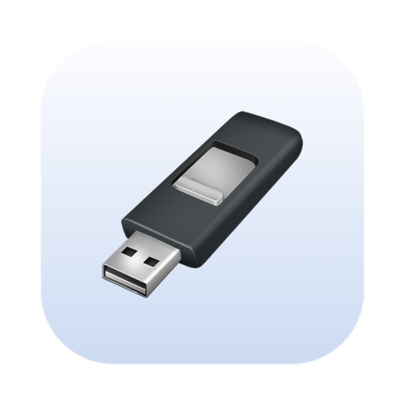
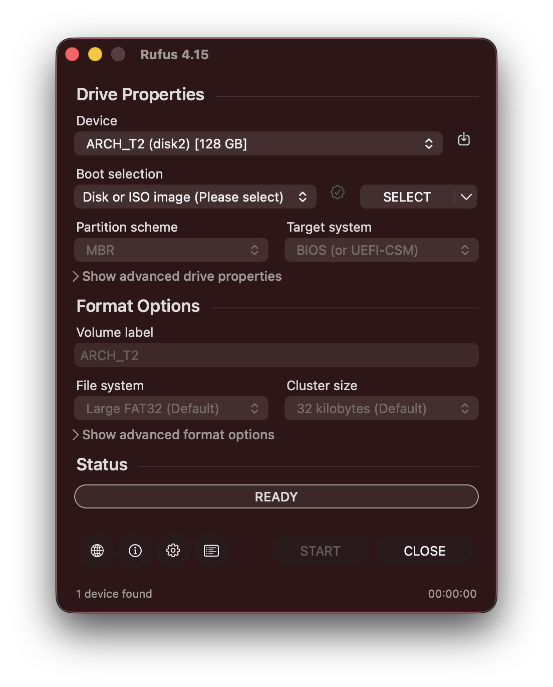
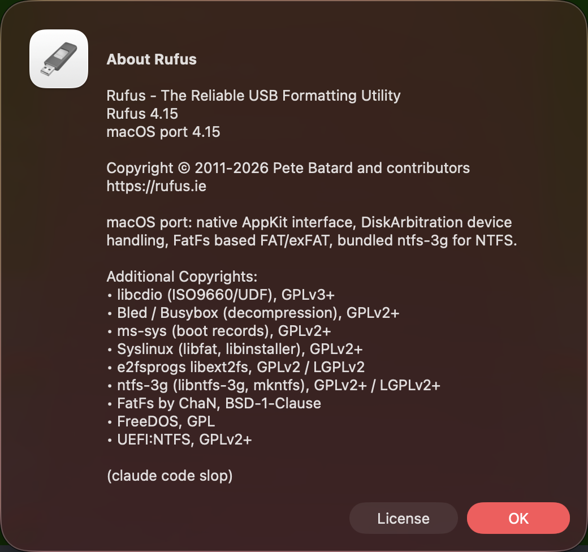
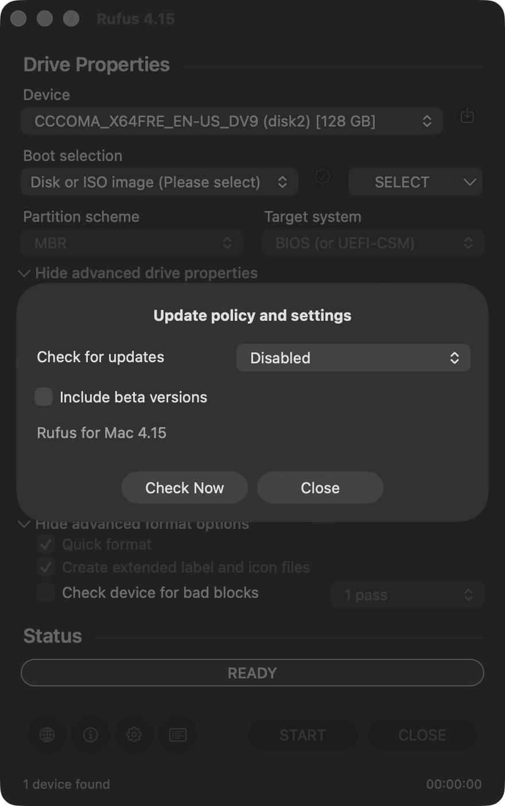
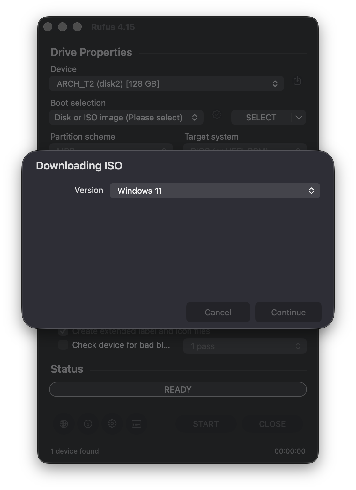
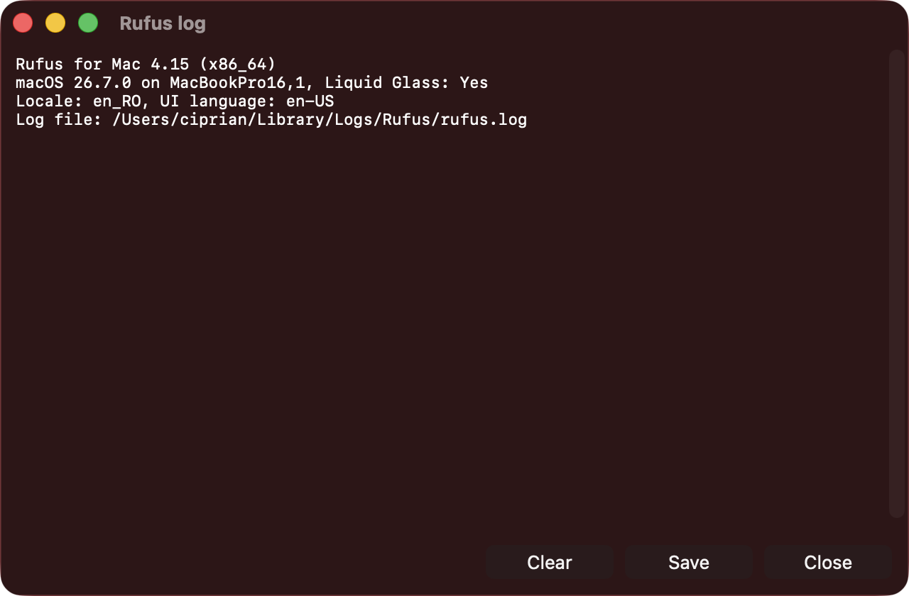

<p align="center"></p>

# Rufus for Mac (claude code slop)

A native macOS port of [Rufus](https://rufus.ie), the utility that creates bootable USB drives from
ISO and disk images. It keeps the exact layout of Windows Rufus, dressed in Apple's Liquid Glass.

<p align="center"></p>

## Download

Get the latest **[Rufus-&lt;version&gt;-universal.dmg](https://github.com/nichols2124/rufus-for-mac/releases/latest)**
from the Releases page. It's a universal app (Intel + Apple Silicon): open the DMG and drag Rufus to
Applications. Each release also has a `SHA256SUMS.txt` to verify the download
(`shasum -a 256 -c SHA256SUMS.txt`). Rufus checks this page for updates (⚙ Settings → Check for updates).

Requires **macOS 10.15 Catalina or later**. The app is ad-hoc signed, not notarized, so the first
time you open it, right-click Rufus.app → **Open**. On macOS 15+, go to **System Settings → Privacy &
Security → Open Anyway**. Or clear the quarantine flag:

```sh
xattr -dr com.apple.quarantine /Applications/Rufus.app
```

Nothing else needs to be installed: NTFS support (ntfs-3g) is bundled, no macFUSE or MacPorts needed.

## Features

- **Windows installers**: Windows 10/11 ISOs on GPT/UEFI or MBR/BIOS, NTFS with the
  [UEFI:NTFS](https://github.com/pbatard/uefi-ntfs) partition, and `install.wim` files over 4 GB.
- **Windows 11 customization**: remove the TPM / Secure Boot / 4 GB RAM requirements, skip the
  Microsoft account, create a local account, copy your regional settings, disable data collection
  and BitLocker, QoL tweaks, and an expert silent install.
- **Linux ISOs**: ISO mode (FAT32) with label patching for GRUB/Syslinux configs, Syslinux 4/6 for
  BIOS boot, Ubuntu/Debian **persistence** partitions, or DD mode for ISOHybrid images.
- **DD image writing**, including compressed `.gz`, `.xz`, `.bz2`, `.zst`, `.zip`, `.lzma`, `.Z` and `.vtsi` images.
- **FreeDOS** bootable drives.
- **File systems**: FAT, FAT32 (including Large FAT32), exFAT, NTFS, ext2, ext3, plus Super Floppy Disk layout.
- **ISO download**: a native port of [Fido](https://github.com/pbatard/Fido) that fetches official
  Windows 10/11 ISOs from Microsoft, plus UEFI Shell ISOs.
- **Checksums**: MD5, SHA-1, SHA-256 (and SHA-512 with ⌥H).
- **Bad blocks check**, 1 to 4 passes.
- **Save drive to image** (the 💾 button).
- **38 languages** from Rufus' own translations, including right-to-left layouts.
- **Dark mode** and **Liquid Glass** (macOS 26), with a classic fallback on older macOS.
- **All of Rufus' secret keyboard shortcuts** (see below).

<p align="center">
  
  
</p>
<p align="center">
  
  
</p>

## Keyboard shortcuts

Rufus' "cheat mode" shortcuts work as on Windows: **Alt → ⌥ Option**, **Ctrl → ⌃ Control or ⌘ Command**.

| Shortcut | Action |
|---|---|
| ⌘L / ⌃L | Show or hide the log |
| ⌃A | Select the log |
| ⌃P | Persistent log (appended across sessions) |
| ⌃T | Hash self-test |
| ⌃ + SELECT | Pick an extra archive whose content is copied to the drive |
| ⌥+ / ⌥− | Raise / lower the priority of the operation |
| ⌥. | USB debug logging |
| ⌥, | Toggle exclusive drive locking |
| ⌥A | Toggle Rufus MBR for Windows |
| ⌥B | Toggle fake drive detection (bad blocks) |
| ⌥C | Eject the device, to cycle it (macOS can't power-cycle USB ports) |
| ⌥D | Delete Rufus' downloaded files directory |
| ⌥E | Dual UEFI/BIOS mode (also allows FAT32 for Windows) |
| ⌥F | Toggle USB hard drive detection |
| ⌥G | Toggle virtual disk (disk image) detection |
| ⌥H | Toggle SHA-512 in checksums |
| ⌥I / ⌥J / ⌥K | Toggle ISO support / Joliet / Rock Ridge |
| ⌥L | Force Large FAT32 |
| ⌥M | Toggle boot marker check |
| ⌥N | NTFS compression |
| ⌥O | Save an optical disc to ISO |
| ⌥P | Toggle a GPT ESP to/from Basic Data |
| ⌥Q | File indexing |
| ⌥R | Reset all settings |
| ⌥S | Toggle size checks |
| ⌥T | Preserve timestamps |
| ⌥U | Toggle proper size units (GB vs GiB) |
| ⌥V / ⌥X | Windows-only (VDS / NoDriveTypeAutorun): not applicable on macOS |
| ⌥W | Toggle VMware disk detection |
| ⌥Y / ⌃⌥Y | Force update check |
| ⌥Z / ⌃⌥Z | Zero the drive / fast-zero (skip empty blocks) |
| ⌃⌥D | Toggle dark mode |
| ⌃⌥E | Expert mode |
| ⌃⌥F | List non-USB removable drives |

### Differences from Windows Rufus

- **Windows To Go** isn't available: it needs a Windows image apply step that isn't ported yet.
- **Runtime UEFI media validation** is shown but disabled, because its bootloaders aren't bundled.
- **Splitting `install.wim` for FAT32** isn't ported. Windows ISOs with files over 4 GB use NTFS,
  which is Rufus' default anyway.
- **Windows 11 bypass options** go into an `autounattend.xml` at the root of the drive, where
  Windows Rufus edits the registry inside `boot.wim` using Windows-only APIs. Same end result.
- **Syslinux** is embedded for versions 4.07 and 6.04. ISOs using other Syslinux versions get a
  warning suggesting DD mode.
- **Built-in SD card readers** are listed like USB card readers.

## Building

Only the Xcode Command Line Tools are needed (`xcode-select --install`), not Xcode.

```sh
cd macos
make                 # build/Rufus.app, universal (Intel + Apple Silicon)
make ARCHS=x86_64    # or a single architecture, faster
make run             # build and launch
make debug           # launch under lldb
make dmg             # build/Rufus-<version>.dmg
make cli             # build/rufus-cli (engine test tool)
tests/run-tests.sh   # 21 engine tests on disk image files, no USB drive needed
```

The log is written to `~/Library/Logs/Rufus/rufus.log` (also available with ⌘L).

`rufus-cli` runs the whole engine on image files or, as root, on real devices:

```sh
build/rufus-cli --scan Win11.iso
build/rufus-cli --create 8G --image Win11.iso --gpt --uefi --fs ntfs test.img
build/rufus-cli --create 4G --image ubuntu.iso --mbr --bios --persistence 2G test.img
```

## License

[GNU General Public License v3.0](LICENSE.txt), like Rufus.

Rufus is © 2011-2026 Pete Batard and contributors. This port bundles libcdio (GPLv3+),
Bled/Busybox (GPLv2+), ms-sys (GPLv2+), Syslinux (GPLv2+), e2fsprogs libext2fs (GPLv2/LGPLv2),
ntfs-3g (GPLv2+/LGPLv2+), FatFs (BSD-1-Clause), FreeDOS (GPL) and UEFI:NTFS (GPLv2+).
This is an unofficial port and isn't endorsed by the Rufus project. The original Rufus README is
in [`docs/README-rufus-upstream.md`](docs/README-rufus-upstream.md).
